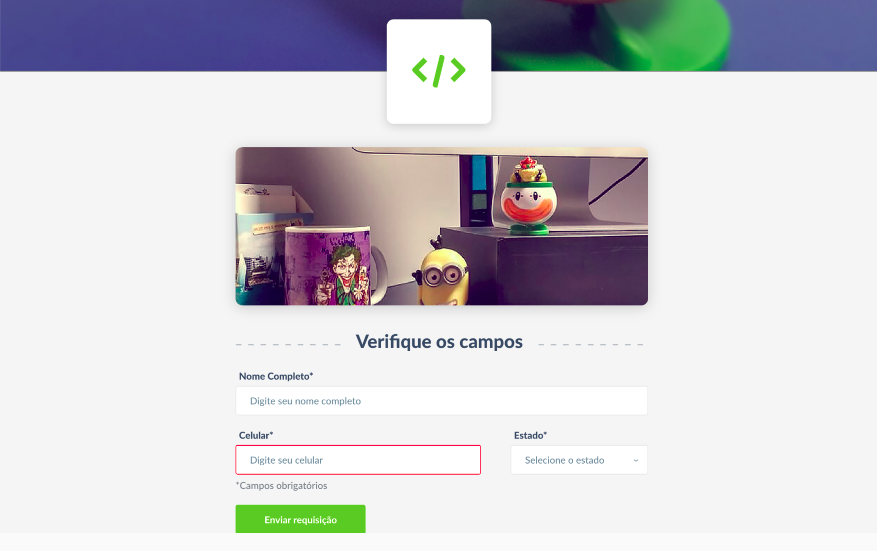

# BeHOH Front-end Challenge

A simple form app made with React.
[Live Demo](https://behoh-frontend-chanllenge.herokuapp.com/)
## Installation

Clone the repository and run command below to install node dependencies
```
npm install or yarn install
```
## Start
```
npm start or yarn start
```

## Technologies
- React
- Axios
- Create-React-App
